# [Modern React with Redux [2020 Update]](https://www.udemy.com/course/react-redux/)

## プロジェクトについて

### jsx

セクション 1 で作成したプロジェクト  
JSX って何、どんな風に書くのって簡単な紹介のためのプロジェクト


### components

セクション 3 で作成したプロジェクト。  
Components って何、どんな風に書くの・使うのってためのプロジェクト。  
Style は [Semantic UI](https://semantic-ui.com/)、アバター画像とかテキストは [faker.js](https://github.com/marak/Faker.js/) を利用。  
ボタンにアクションは設定されていない。  
単に ApprovalCard と CommentDetail で Components ってコンポ作って index.js から呼び出す。その際 index.js からそれぞれのコンポへ props 渡してる。また、CommentDetail は ApprovalCard の子要素、ってだけ。  


### seasons

セクション 4 で作成したプロジェクト。  
Class Components を使用。  
参照者の[ロケーション](https://developer.mozilla.org/ja/docs/Web/API/Geolocation_API)（北半球 or 南半球）と[いまが何月か](https://developer.mozilla.org/ja/docs/Web/JavaScript/Reference/Global_Objects/Date/getMonth)によってテキストやスタイルを変えて表示するって割と表示としてはくだらない。ただ、  
Class Components や state をどう使うか/書くか、[Class Components ライフサイクルがどうなっているか](#class-components-のライフサイクル)、[CSS をどう適用するか](#css-適用)などを学べる。


読み込み中（1c84e7ba）とエラー画面（35e875ab）を用意してるのも実践的でお勉強になる。


### pics

これも Class Components。

検索ボックスの Form を表示。Form が Submit されたら入力されているテキストに応じた画像を[Unsplash](https://unsplash.com/)から[axios](https://github.com/axios/axios) を使って取得して表示する。  
ブラウザの width に応じて横 x 列で表示する。横 x 列表示のため CSS `display: grid`を指定。Unsplash から取得される画像サイズの縦横比は各々違う。CSS で横幅は`250px`固定にしたうえで、画像の高さを動的に取得して CSS `grid-row-end/gridRowEnd` を書き換え、隙間がムダに広くなるのを防止している。  
[Unsplash から取得する画像は先頭 10 件のみ](https://unsplash.com/documentation#search-photos)でそれより後の画像を取得するような処理はない。

割と急にレベル高くなった感ある...。


### videos

セクション 11（116 ～ 136）で使用するプロジェクト。このセクションは pics プロジェクトのおさらい・Class Components のおさらいのためスキップ。create-react-app した直後の状態のまま。

### widget

4 種類のウィジェットをつくって、それをナビゲーション機能で切り替えられるようにしましょうってプロジェクト。

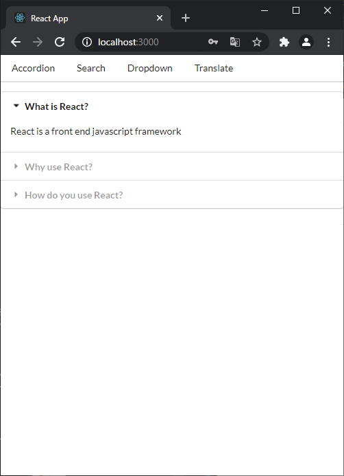
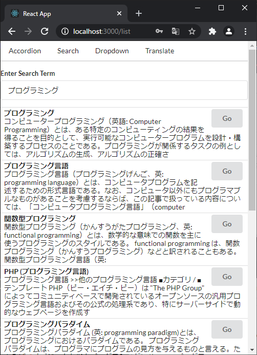
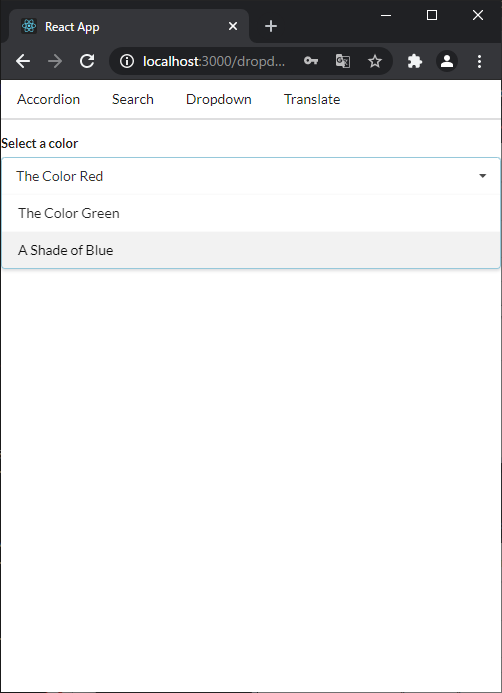
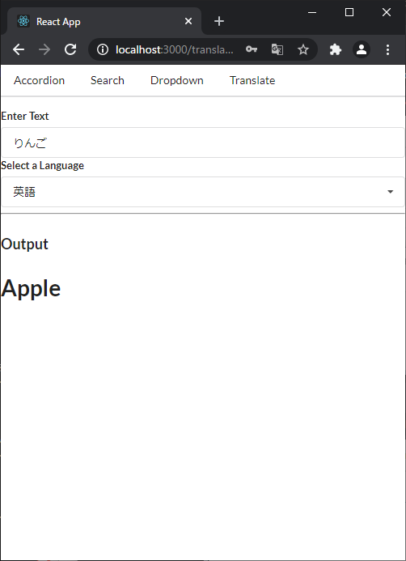

左から順に以下の機能。

1. [Accordion](widget/src/components/Accordion.jsx) は クリックされたら開いて詳細表示。同時に詳細表示してる項目は 1 個になるように他が開いたら閉じるってだけの単純なウィジェット。けどよく見るし実用性ありそう（よく見るだけに、自分で実装しなくてもライブラリなりで共通コンポとして使える OSS なりなんかはありそう）。詳細は [#ウィジェット-アコーディオン](#ウィジェット-アコーディオン) 参照。
1. [Search](widget/src/components/Search.jsx) は検索ボックス表示して、そこに入力された*検索ワード* を[Wikipedia API](https://ja.wikipedia.org/w/api.php)で Wikipedia に投げて、取得結果を表示するってウィジェット。検索ボックスに入力された*検索ワード*は`form#submit`されたら投げるんじゃなくて、`input.onChange`にイベントハンドラー設定して、`onChange`が止まってから 500ms 経過したら API 投げるって処理してておもろい。
1. [Dropdown](widget/src/components/Dropdown.jsx) はドロップダウンリスト表示して、クリックされたら開いて、リスト内の項目がクリックされたりそれ以外の任意の要素クリックされたら閉じるって、見た目的には全然おもしろくないウィジェット。ただ、イベントハンドラーのお勉強にめちゃなった。詳細は[#react-のイベントハンドラー](#react-のイベントハンドラー)参照。
1. [Translate](widget/src/components/Translate.jsx)は、*テキストボックス*と*言語一覧のリストボックス*を表示して、そこに入力された情報を [Google Cloud の Cloud Translation](https://cloud.google.com/translate/docs/reference/rest/v2/translate?hl=ja) に投げて、翻訳結果を表示するってウィジェット。このウィジェットで新しく学ぶものはないかも？他 3 つのウィジェットの応用な感じかも。動作させるためには、.env ファイルを作成し、キー`REACT_APP_GOOGLE_TRANSLATE_API_KEY`を有効な `API Key` で定義する必要がある。

ナビゲーションは react-router を利用せずスクラッチから実装する。ちなみに後のセクションで react-router も使うらしい。  
今回 react-router を使わない理由は、react-router は互換性ない変更がたびたび入るらしく、ナビゲーションの基本的なアイデア・セオリーは知っておきましょう、だから使わず実装してみましょうってことみたい（ありがたい 😊）。  
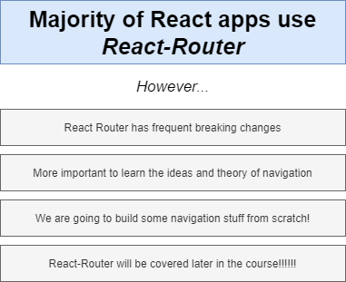

実装の詳細は [#ナビゲーション router](#ナビゲーションrouter) 参照。

### videoshooks

Class Components で作成されたプロジェクトを Hooks System に変更することで、Hooks System の理解を深めましょうってプロジェクト。

### blog

Redux お勉強  
TODO

### streams

React Router お勉強

[#React Router](#React-Router)

[GoogleAPI の OAuth2.0 スコープ](https://developers.google.com/identity/protocols/oauth2/scopes)

[gapi.auth2.getAuthInstance](https://developers.google.com/identity/sign-in/web/reference#gapiauth2getauthinstance)

[Github - redux-devtools-extension](https://github.com/zalmoxisus/redux-devtools-extension)

[npm - @redux-devtools/core](https://www.npmjs.com/package/@redux-devtools/core)

> Also try opening http://localhost:3000/?debug_session=123, click around, and then refresh. You should see that all actions have been restored from the local storage.

[npm - redux-form](https://www.npmjs.com/package/redux-form)

[redux-form examples](https://redux-form.com/8.3.0/examples/)

[npm - json-server](https://www.npmjs.com/package/json-server), [github - lowdb](https://github.com/typicode/lowdb)

[React - ポータル](https://ja.reactjs.org/docs/portals.html), [MDN - Stacking Context（重ね合わせコンテキスト）](https://developer.mozilla.org/ja/docs/Web/CSS/CSS_Positioning/Understanding_z_index/The_stacking_context), [Semantic-UI - Modal - Actions](https://semantic-ui.com/modules/modal.html#actions)

[GitHub - Node-Media-Server](https://github.com/illuspas/Node-Media-Server)

TODO

## npm install -g create-react-app は非推奨

`npx create-react-app my-app`が推奨

> If you've previously installed create-react-app globally via npm install -g create-react-app, we recommend you uninstall the package using npm uninstall -g create-react-app

> npx always uses the latest version.

[Create React App - Getting Started - Quick Start](https://create-react-app.dev/docs/getting-started#quick-start)より引用

それはそうなんだけど公式で npx 推奨はじめて知った

## document.querySelector("#root") vs document.getElementById("root")

`ReactDOM.render(<App />, document.querySelector("#root"));` が [レクチャ 13](https://www.udemy.com/course/react-redux/learn/lecture/12531070#notes)で使われている。

[Qiita 記事](https://qiita.com/amamamaou/items/25e8b4e1b41c8d3211f4#%E7%89%B9%E5%AE%9A%E3%81%AEid%E3%81%AE%E8%A6%81%E7%B4%A0%E3%82%92%E5%8F%96%E5%BE%97%E3%81%99%E3%82%8B%E6%99%82)とか[MeasureThat.net](https://www.measurethat.net/Benchmarks/Show/2488/0/getelementbyid-vs-queryselector)の記載見る限り、getElementById の方が querySelector よりも性能良いらしい。

基本的に`ReactDOM.render(<App />, document.getElementById("root"));`使っておけば良いと思う。大した性能差じゃないっぽいし気にする必要もないとは思うけど。

## create-react-app(CRA)で作成したプロジェクトの ホット/ライブ リロード

React の特定のバージョンでホットリロードが有効にならないバグがあるっぽい。というか実際、CRA でプロジェクト作成 (`"react": "^17.0.2"`) した後、src ディレクトリ 空にして index.js 一から書くと起こる。  
[Hot Reload stopped working with React "^17.0.1" #9904](https://github.com/facebook/create-react-app/issues/9904)

Udemy で紹介された以下で回避はできるっぽい。

index.js に以下を追記。追記後にサーバ再起動。

```js
if (module.hot) {
  module.hot.accept();
}
```

参考: [Webpack - hot-module-replacement](https://webpack.js.org/api/hot-module-replacement/)

## Babel の変換を確認

[Babel - Try it out](https://babeljs.io/repl#)

## JSX の className vs class

> CSS クラスを指定するには、className 属性を使用してください。このことは `<div>`、`<a>` など全ての標準 DOM 要素と SVG 要素に当てはまります。

> React を（一般的ではありませんが）Web Components とともに使用する場合は、代わりに class 属性を使用してください。

[React - DOM 要素 - className](https://ja.reactjs.org/docs/dom-elements.html#classname) より引用

[React Fire: Modernizing React DOM](https://github.com/facebook/react/issues/13525#issuecomment-417818906) 経緯が説明されてる

## Class Components vs Hooks System


## クラスコンポーネント/Class Components

本講座では Class Components も取り上げられている。  
その理由は、Redux を理解するには Function Components/Hooks のみを理解した状態では困難（Class Components を理解してからの方が簡単）だからだと [47. Class-Based Components](https://www.udemy.com/course/react-redux/learn/lecture/12531182) で説明されている。

## Semantic UI

適用方法として _semantic ui cdn_ でぐぐって、[cdnjs](https://cdnjs.com/libraries/semantic-ui)ってとこから ~~Tag/~~ URL 取得するってやり方してる。

Tag 取得に含まれる`crossorigin="anonymous"`などの指定があると CORS 発生するっぽい？以下の指定の方が良いっぽい（詳しく理解できてない）。

```html
<link
  rel="stylesheet"
  href="https://cdnjs.cloudflare.com/ajax/libs/semantic-ui/2.4.1/semantic.min.css"
/>
```

加えて、上記指定しても Chrome だと CORS で読み込み失敗するかも（ブラウザのキャッシュデータとか綺麗なら問題なく読み込めるのかも）。[この辺](https://webbibouroku.com/Blog/Article/cors-browser-setting)とか参考にブラウザ起動すると（`"C:\Program Files (x86)\Google\Chrome\Application\chrome.exe" --disable-web-security --user-data-dir="C://Chrome dev session"`）表示できるようになるかも。

- [ユーザカード](https://semantic-ui.com/views/card.html)
- [ボタン](https://semantic-ui.com/elements/button.html)
- [ローディング/読み込み中](https://semantic-ui.com/elements/loader.html)

## Class Components のライフサイクル

[React - React.Component - コンポーネントライフサイクル](https://ja.reactjs.org/docs/react-component.html#the-component-lifecycle)


## CSS 適用

260b692 参照  


## Controlled Component vs Uncontrolled Component

b8681368 の変更にある通り、たとえば input タグの value を DOM?HTML? で直接書き換えている状態が Uncontrolled Component。Controlled Component は`value={this.state.term}`のように value を React/state で管理する状態。詳細は以下の React 公式の説明を参照。

- [制御されたコンポーネント/Controlled Component](https://ja.reactjs.org/docs/forms.html#controlled-components)
- [非制御コンポーネント/Uncontrolled Component](https://ja.reactjs.org/docs/uncontrolled-components.html)

Class Components 利用時のみ関連する話？  
Hooks System/Functional Components では（※1）、じゃけぇさんの TODO アプリみたいに親コンポ（App.js）で state を宣言して、子コンポに渡すのが一般的？もしそうだと Redux 要らないかも。  
※1: Hooks System/Functional Components の特徴なのか書き手などそれ以外の特徴によるのか、うーん...🤔TODO

## Context Issue "this"

Class Component で state 参照時 _TypeError: Cannot read property 'state' of undefined_ が発生するケースと対処について。

たとえば以下の onFormSubmit メソッドの console.log で発生する。これは console.log で参照している this には state プロパティが存在しないため。

```js
class SearchBar extends React.Component {
  onFormSubmit(event) {
    event.preventDefault();
    console.log(this.state.term);
  }
  // 省略
  render() {
    <form className="ui form" onSubmit={this.onFormSubmit}>
```

対処方法はいくつかあるけど、アロー関数にするのが書き方としてはシンプル。

```js
onFormSubmit = (event) => {
  event.preventDefault();
  console.log(this.state.term);
};
```

アロー関数を利用するメリットの 1 つは 宣言された時点での this を bind して、呼び出し元のオブジェクトにかかわらず不変であること。

詳細は以下参照。

- [個人ブログ - 「TypeError: Cannot read property ‘state’ of undefined」に出会ったら Javascript の”this”について真剣に考えよう](https://applingo.tokyo/article/1422)
- [Qiita - 【JavaScript】アロー関数式を学ぶついでに this も復習する話](https://qiita.com/mejileben/items/69e5facdb60781927929)

これより下は直接あんまり関係ないかも。this に興味出てきて見たもの。

- [MDN - アロー関数 - this を束縛しない](https://developer.mozilla.org/ja/docs/Web/JavaScript/Reference/Functions/Arrow_functions#no_separate_this)
- [個人ブログ【JavaScript の基礎】レキシカルスコープとクロージャを理解する](https://wemo.tech/904)
- [Google JavaScript Style Guide 和訳 - JavaScript Language Rules - クロージャ](https://cou929.nu/data/google_javascript_style_guide/#id23)
- [MDN - クロージャ](https://developer.mozilla.org/ja/docs/Web/JavaScript/Closures)
- [MDN - WindowOrWorkerGlobalScope.setTimeout() - "this" 問題](https://developer.mozilla.org/ja/docs/Web/API/WindowOrWorkerGlobalScope/setTimeout#the_this_problem)
- [MDN - this - オブジェクトのメソッドとして](https://developer.mozilla.org/ja/docs/Web/JavaScript/Reference/Operators/this#as_an_object_method)

以前から以下のときに myFunc()で name 見えているのなんでだろとは気になってはいた。

```js
function makeFunc() {
  var name = "Mozilla";
  function displayName() {
    alert(name);
  }
  return displayName;
}

var myFunc = makeFunc();
myFunc();
```

ちゃんと理解できてないまま沼ってきた感ある 😌 以下が説明になっているの分かってはいるんだけどクロージャっていままでちゃんと考えてきたこともないのもあってなんか理解できてない感ある。あとで戻ってきて理解し直す ⇒ 一日経ってなんとなく分かってきたかも。[個人ブログ【JavaScript の基礎】レキシカルスコープとクロージャを理解する](https://wemo.tech/904) ← これめちゃ分かりやすい。

> クロージャは、組み合わされた（囲まれた）関数と、その周囲の状態（レキシカル環境）への参照の組み合わせです。言い換えれば、クロージャは内側の関数から外側の関数スコープへのアクセスを提供します。JavaScript では、関数が作成されるたびにクロージャが作成されます。

最初の話に戻って、`console.log(this.state.term);`の this は`onSubmit={this.onFormSubmit}`で呼び出されてるんだから this は _「オブジェクトのメソッド」として呼び出された関数ではそのときのオブジェクト_ = SearchBar になっている気はするんだけど、実際は strict モードだからか undefined。なんで undefined になっているかがうーん...🤔 ちゃんと理解できてない。現時点の認識では、`onSubmit={this.onFormSubmit}`で、onSubmit には onFormSubmit メソッドへのポイントが代入される。onSubmit が実際に実行されるときには、[window](https://developer.mozilla.org/ja/docs/Web/API/Window)オブジェクトによって実行されるため、this は（strict-mode により）undefined になっている（合っているのだろうか 🤔）。

```js
class SearchBar extends React.Component {
  onFormSubmit(event) {
    event.preventDefault();
    console.log(this.state.term);
  }
  // 省略
  render() {
    <form className="ui form" onSubmit={this.onFormSubmit}>
```

TODO あとでちゃんと読む

- [React - FAQ - そもそもバインドはなぜ必要なのか？](https://ja.reactjs.org/docs/faq-functions.html#why-is-binding-necessary-at-all)
- [個人ブログ - Understanding JavaScript Function Invocation and "this"](https://yehudakatz.com/2011/08/11/understanding-javascript-function-invocation-and-this/)

## イベントハンドラーにアロー関数を使う理由

× `<div className="title active" onClick={onTitleClick(index)}`  
○ `<div className="title active" onClick={() => onTitleClick(index)}`  
以下、現時点の認識。正確でないかも。  
× は 呼び出された/render された時点で onTitleClick 関数が実行され onClick にはその実行結果が入ってしまい、onClick イベント発生時には onTitleClick 関数自体は実行されないため。  
onClick イベントが発生したときに onTitleClick 関数を実行したい場合は、○ の通り、アロー関数を使うなどして関数へのポインターを onClick に代入しておく必要がある。  
引数がない場合は `onClick={onTitleClick}` で OK。

```js
const Accordion = ({ items }) => {
  const onTitleClick = (index) => {
    console.log("Title clicked", index);
  };

  const renderedItems = items.map(({ title, content }, index) => {
    return (
      <React.Fragment key={title}>
        <div className="title active" onClick={() => onTitleClick(index)}>
```

[React - FAQ - イベントハンドラやコールバックにパラメータを渡すには？](https://ja.reactjs.org/docs/faq-functions.html#how-do-i-pass-a-parameter-to-an-event-handler-or-callback)

## Linter/リンター

### Class Components

`npx create-react-app <app-name>`でプロジェクト作成後に`./node_modules/.bin/eslint --init`して対話的に設定ファイル作れば基本それで良い。ただ、以下のように Babel 使った state の初期化処理書くと違反になる。これは 94645888（※1）にあるように [babel-eslint](https://www.npmjs.com/package/babel-eslint) 導入して、rules に [react/state-in-constructor](https://github.com/yannickcr/eslint-plugin-react/blob/master/docs/rules/state-in-constructor.md) 指定すれば良い。  
※1：後で見直して気付いたけどこれミスってる。babel-eslint が dependencies になっちゃってる。本来は devDependencies にするのが正しい。詳細な手順は[babel-eslint](https://www.npmjs.com/package/babel-eslint)を参照。

```js
class SearchBar extends React.Component {
  state = { term: "" };
```

### Functional Components/Hooks System

`./node_modules/.bin/eslint --init` したあと、[React - フックのルール - ESLint プラグイン](https://ja.reactjs.org/docs/hooks-rules.html#eslint-plugin)にある通り、eslint 設定ファイルへ Hooks 向け定義を追記すれば良い。

f3359c6 参照。

`react-hooks/exhaustive-deps` この rule は無効でも良いかも。もうちょっと useEffect 理解できてから追記 TODO

[React - フックのルール - ESLint プラグイン](https://ja.reactjs.org/docs/hooks-rules.html#eslint-plugin)

### Hooks System useState()

Functional Component はレンダリングのたびに実行されるから useState が何回も実行される。たとえば以下で`const [activeIndex, setActiveIndex] = useState(null);`は Accordion コンポがレンダリングされるたびに実行されてる。

```jsx
const Accordion = ({ items }) => {
  const [activeIndex, setActiveIndex] = useState(null);
```

なんで activeIndex を誤って初期化しちゃわないのかなーって気になったけど公式に以下記載があるし、どこかでコンポ毎に（？）useState なり useEffect なりの情報を順番ベースで覚えて管理/対応してるっぽい。

[React - フックのルール - フックを呼び出すのはトップレベルのみ](https://ja.reactjs.org/docs/hooks-rules.html#only-call-hooks-at-the-top-level)

> あらゆる早期 return 文よりも前の場所で呼び出してください。これを守ることで、コンポーネントがレンダーされる際に毎回同じ順番で呼び出されるということが保証されます。これが、複数回 useState や useEffect が呼び出された場合でも React がフックの状態を正しく保持するための仕組み

## ウィジェット - アコーディオン

クリックされたら開くって仕組み。使えそう。 d389b04

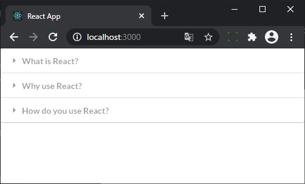
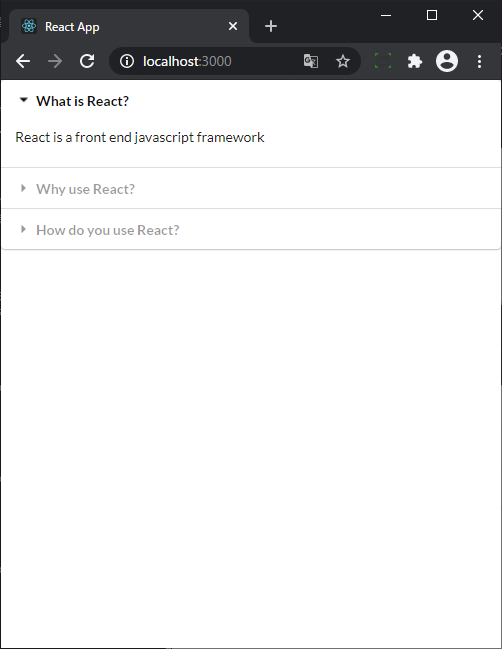

## state - Class Components vs Functional Components


## useEffect

### 第 2 引数

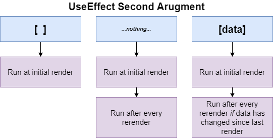

### 戻り値、クリーンアップ

useEffect に指定する関数は、戻り値として関数ポインターをクリーンアップ用関数として指定できる（関数ポインターとは言わないっぽい...。なんて言うのが適切なんだろ）。ここで指定した関数は、以下のタイミングで実行される。

> コンポーネントが UI から削除される前

> コンポーネントが複数回レンダーされる場合（大抵はそうですが）、新しい副作用を実行する前に前回の副作用はクリーンアップ

[React - フック API リファレンス - エフェクトのクリーンアップ](https://ja.reactjs.org/docs/hooks-reference.html#cleaning-up-an-effect)

実装例は c8465706 参照。  
検索 Form に入力された*検索ワード*を onChange で捕捉して、500ms 以内に onChange が再発生しなければ、つまり入力された*検索ワード*が変わらなければ検索 API 投げる例。

## React のイベントハンドラー

React でイベントハンドラーを登録すると、指定の要素に直接登録するのではなく、[ルート DOM コンテナに対して登録](https://ja.reactjs.org/blog/2020/08/10/react-v17-rc.html#changes-to-event-delegation) される。

なんでそんなことをしているかは以下参照。  
[React - Blog - React v17.0 Release - イベントデリゲーションに関する変更](https://ja.reactjs.org/blog/2020/08/10/react-v17-rc.html#changes-to-event-delegation)

> ほとんどのイベントでは、実際には React はあなたが宣言した DOM ノードにイベントハンドラをアタッチするのではありません。代わりに、イベントタイプごとにハンドラを 1 つだけ、document ノードに直接アタッチします。これはイベントデリゲーション（event delegation; イベントの委譲）と呼ばれます。大きなアプリケーションツリーではパフォーマンス面で有利であるということに加え、これによりイベントのリプレイといった新機能も追加しやすくなります。

> React 17 では、React は document レベルにイベントハンドラをアタッチしないようになります。代わりに、あなたが React ツリーをレンダーしようとしているルート DOM コンテナに対してアタッチするようになります。

親/祖先 DOM に対してイベントハンドラーを登録しているのに、意図した通りにイベントハンドラーが実行される理由は React が正しく[イベント移譲(Event delegation)](https://ja.javascript.info/event-delegation) を利用しているため（と理解してる）。

### バブリング、キャプチャリング

たとえば d63d281 で、div.item をクリックすると、コンソール出力は`BODY CLICKED` -> `ITEM CLICKED` -> `DROPDOWN CLICKED`の順でされる。これは、body は キャプチャリングフェーズで実行 -> div.item はターゲットフェーズで実行 -> div.ui.selection はバブリングフェーズで実行 のため。

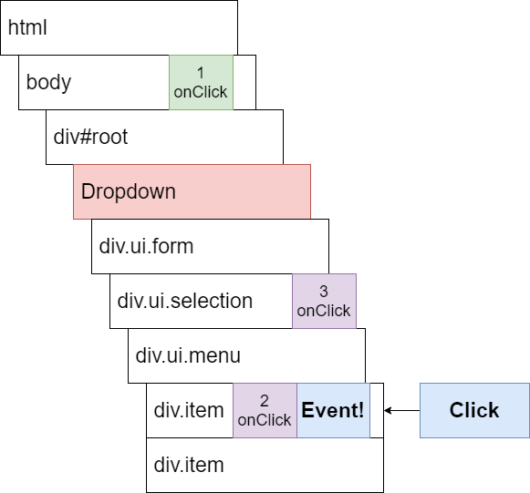

詳細は以下を参照。

- [The Modern JavaScript Tutorial - バブリング と キャプチャリング](https://ja.javascript.info/bubbling-and-capturing#ref-1499)
- [MDN - イベントへの入門 - イベントのバブリングとキャプチャリング](https://developer.mozilla.org/ja/docs/Learn/JavaScript/Building_blocks/Events#event_bubbling_and_capture)

### バブリング/キャプチャリングの利用例

b89bee6 は、ドロップダウンリストが開いた状態で、任意の場所がクリックされたらドロップダウンリストを閉じるって例。`document.body.addEventListener`により body にイベントハンドラーを登録しておけば、任意の要素でイベント発生時に発火させることができる。

### document.body.addEventListener

`document.body.addEventListener`の第 3 引数に [{capture: true} を指定しないと指定したイベントハンドラーは実行されない](https://ja.reactjs.org/blog/2020/08/10/react-v17-rc.html#fixing-potential-issues)。

b89bee6 の該当行を以下に抜粋。

```js
const Dropdown = ({ options, selected, onSelectedChange }) => {
  useEffect(() => {
    document.body.addEventListener("click", () => setOpen(false), {
      capture: true,
    });
  }, []);
```

これは、ルート DOM コンテナで `e.stopPropagation()` されているから？公式で明記されている箇所が見当たらない。認識誤っているかも。

## ナビゲーション、router

react-router を利用せずナビゲーション機能を実装する方法。

詳細は [Udemy - Modern React with Redux [2020 Update] - セクション 13: Navigation From Scratch](https://www.udemy.com/course/react-redux/learn/lecture/20787914) を参照。

widget プロジェクトの [App.jsx](widget/src/App.jsx#L44-61)、[Header.jsx](widget/src/components/Header.jsx)、[Link.jsx](widget/src/components/Link.jsx)、[Route.jsx](widget/src/components/Route.jsx)あたりが対応する実装。  
もう少し理解できてから追記 TODO。

## カスタムフック

あとで読む TODO
[React - 独自フックの作成](https://ja.reactjs.org/docs/hooks-custom.html)

## Redux

### Redux とは

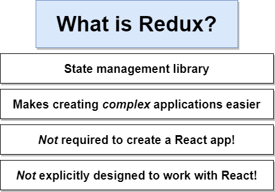

### Redux を採用するメリット

- Redux を採用しない場合 -> アプリが巨大になっていくと複雑さが指数関数的に増してく
- Redux を採用する場合 -> アプリが巨大になっても複雑さはアプリ規模に比例して増えていく

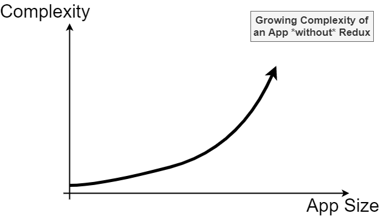
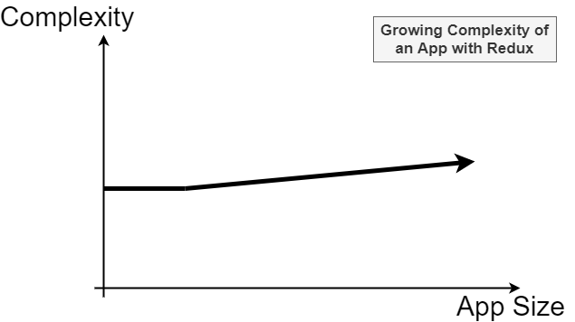

[230. Important Redux Notes](https://www.udemy.com/course/react-redux/learn/lecture/12531416) で説明されている。

Redux を導入しているアプリの場合、データやその取り扱いを変更したい場合、Action Creator を理解してそれを修正すれば良いからって説明。  
Redux をまだ理解できてないだけに、そういうもんなのかなあ 🤔 って感じ。

ただ Redux 自体の理解が最初は難しいよとは説明されてる。分かってきちゃえばめちゃ簡単だよとも。上記の複雑さのグラフが Redux を採用する場合 Complexity が割と高いところからはじまっているところからもわかる通り、小規模のアプリだったら Redux は使わないが無難ではあるのかも。

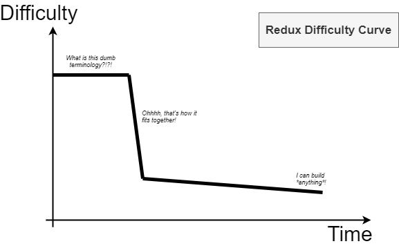

### データローディング Class Components の場合によく採られる方法

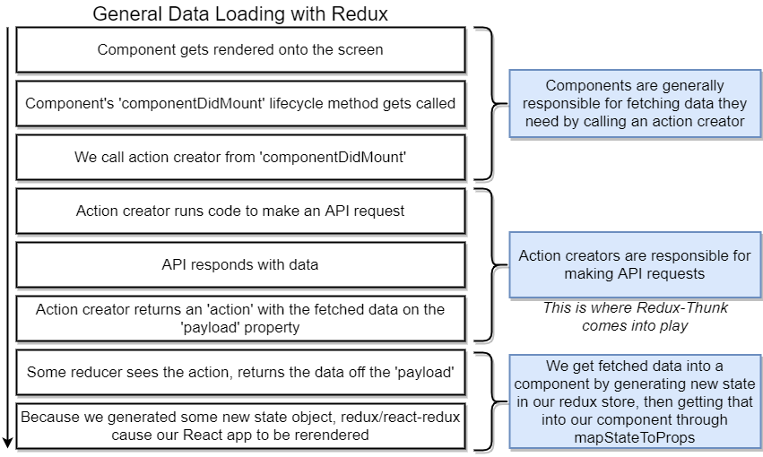

### Redux Thunk

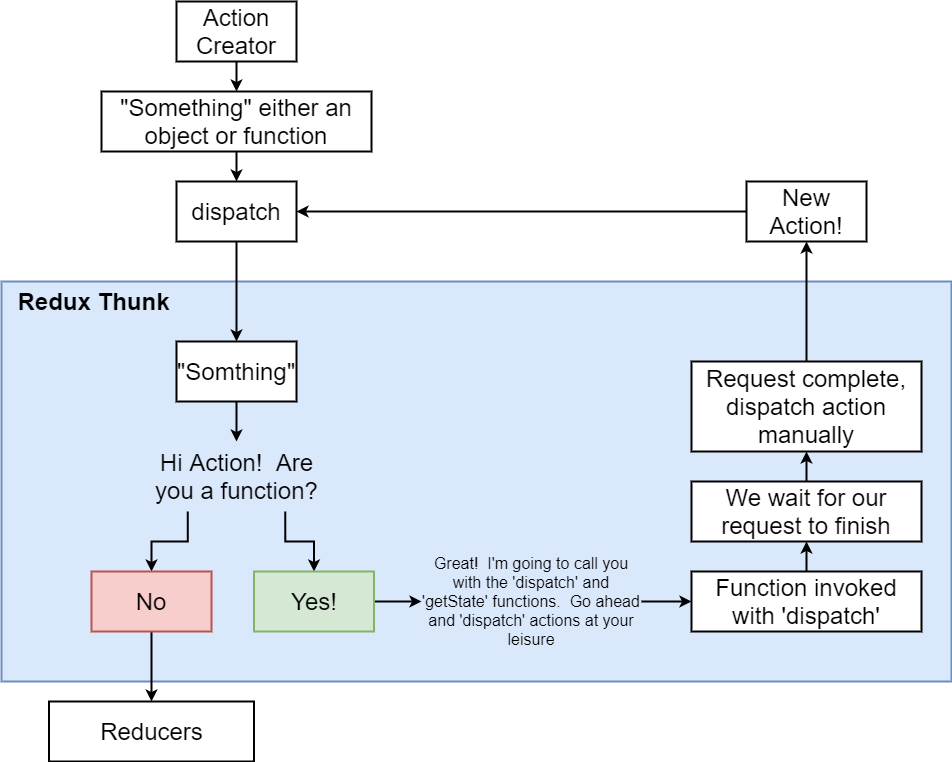

### JavaScript Object mutations

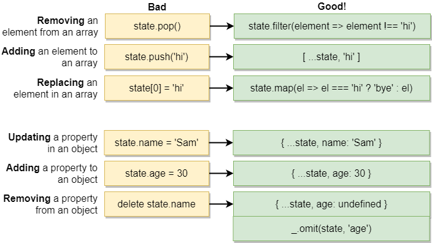

オブジェクトからプロパティを削除する方法で [lodash](https://lodash.com/docs/4.17.15#omit) を使わない方法として[以下が挙げられている](https://stackoverflow.com/questions/34698905/how-can-i-clone-a-javascript-object-except-for-one-key)。

```js
const data = {
  type: "add",
  payload: "payload",
};
const { type, ...coords } = data;
```

変数 type は lint で warning/error になるかと思いきや、デフォルトの設定でもならないっぽい？なる場合でも`eslint no-unused-vars: ["error", { "ignoreRestSiblings": true }]` で [無視できるっぽい](https://github.com/eslint/eslint/commit/c59a0ba)。

## React Router

### Link


### props

react-router-dom.Route に指定したコンポーネントには、props として match などの情報が渡される。

```js
const App = () => {
  return (
    <div className="ui container">
      <Router history={history}>
        <div>
          <Route path="/streams/edit/:id" exact component={StreamEdit} />
        </div>
      </Router>
    </div>
  );
};
```

```js
const StreamEdit = (props) => {
  console.log(props);
  return <>StreamEdit</>;
};
```

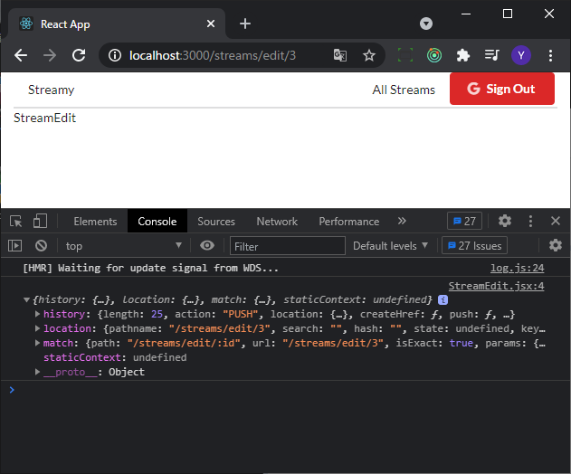

## Redux Form

[npm- redux-form](https://www.npmjs.com/package/redux-form)

現状 redux-form の利用は以下の理由から推奨されていない。

> you should not put your form state in Redux

代替として [npm - react-final-form](https://www.npmjs.com/package/react-final-form) が挙げられており、react-final-form は redux-form と似た IF のようなので、redux-form 学んでおく。

### フォームの InitialValues（初期値）

reduxForm を適用したコンポーネント/要素に、属性 initialValues を指定するとそれがフォームの InitialValues になる。

```js
class StreamForm extends React.Component {
  render() {
    return (
      <form
        className="ui form error"
        onSubmit={this.props.handleSubmit(this.onSubmit)}
      >
        <Field name="title" component={this.renderInput} label="Enter Title" />
        <Field
          name="description"
          component={this.renderInput}
          label="Enter Description"
        />
        <button className="ui button primary">Submit</button>
      </form>
    );
  }
}

export default reduxForm({
  form: "streamForm",
  validate,
})(StreamForm);
```

```js
class StreamEdit extends React.Component {
  render() {
    return (
      <>
        <h3>Edit a Stream</h3>
        <StreamForm
          onSubmit={this.onSubmit}
          initialValues={{
            title: this.props.stream.title,
            description: this.props.stream.description,
          }}
        />
      </>
    );
  }
}
```

initialValues へ指定するオブジェクトのキーは Field に指定した name と一致させる必要がある。

## 進捗

| 日付  | 現在 | 進捗 | 備考                                                                       |
| ----- | ---- | ---- | -------------------------------------------------------------------------- |
| 04/14 | 12   | 12   |                                                                            |
| 04/15 | 29   | 18   |                                                                            |
| 04/16 | 64   | 36   |                                                                            |
| 04/17 | 83   | 20   |                                                                            |
| 04/20 | 91   | 09   |                                                                            |
| 04/21 | 116  | 26   |                                                                            |
| 04/21 | 136  | 21   | セクション 11（116 ～ 136）はスキップ。pics プロジェクトのおさらいのため。 |
| 04/22 | 167  | 32   |                                                                            |
| 04/23 | 182  | 16   |                                                                            |
| 04/26 | 212  | 31   |                                                                            |
| 04/27 | 239  | 28   |                                                                            |
| 04/28 | 257  | 19   |                                                                            |
| 04/30 | 278  | 22   |                                                                            |
| 05/05 | 286  | 09   |                                                                            |
| 05/06 | 319  | 34   |                                                                            |
| 05/07 | 349  | 31   |                                                                            |
| 05/09 | 364  | 16   |                                                                            |
| 05/10 | 381  | 18   |                                                                            |
