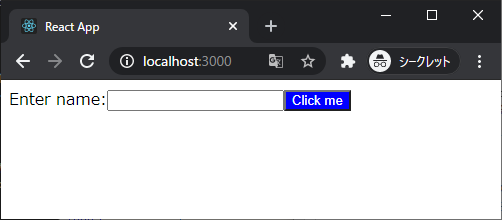
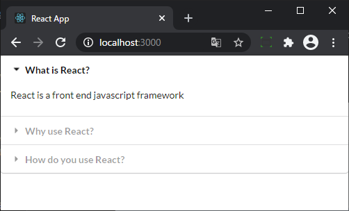
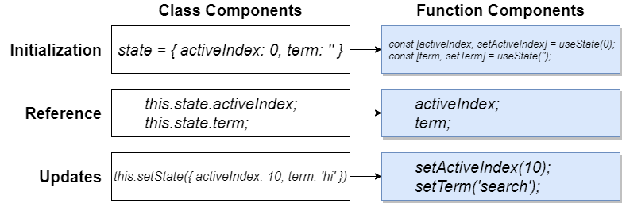

# [Modern React with Redux [2020 Update]](https://www.udemy.com/course/react-redux/)

## プロジェクトについて

### jsx

セクション 1 で作成したプロジェクト  
JSX って何、どんな風に書くのって簡単な紹介のためのプロジェクト



### components

セクション 3 で作成したプロジェクト。  
Components って何、どんな風に書くの・使うのってためのプロジェクト。  
Style は [Semantic UI](https://semantic-ui.com/)、アバター画像とかテキストは [faker.js](https://github.com/marak/Faker.js/) を利用。  
ボタンにアクションは設定されていない。  
単に ApprovalCard と CommentDetail で Components ってコンポ作って index.js から呼び出す。その際 index.js からそれぞれのコンポへ props 渡してる。また、CommentDetail は ApprovalCard の子要素、ってだけ。  


### seasons

セクション 4 で作成したプロジェクト。  
Class Components を使用。  
参照者の[ロケーション](https://developer.mozilla.org/ja/docs/Web/API/Geolocation_API)（北半球 or 南半球）と[いまが何月か](https://developer.mozilla.org/ja/docs/Web/JavaScript/Reference/Global_Objects/Date/getMonth)によってテキストやスタイルを変えて表示するって割と表示としてはくだらない。ただ、  
Class Components や state をどう使うか/書くか、[Class Components ライフサイクルがどうなっているか](#class-components-のライフサイクル)、[CSS をどう適用するか](#css-適用)などを学べる。


読み込み中（1c84e7ba）とエラー画面（35e875ab）を用意してるのも実践的でお勉強になる。


### pics

これも Class Components。

検索ボックスの Form を表示。Form が Submit されたら入力されているテキストに応じた画像を[Unsplash](https://unsplash.com/)から[axios](https://github.com/axios/axios) を使って取得して表示する。  
ブラウザの width に応じて横 x 列で表示する。横 x 列表示のため CSS `display: grid`を指定。Unsplash から取得される画像サイズの縦横比は各々違う。CSS で横幅は`250px`固定にしたうえで、画像の高さを動的に取得して CSS `grid-row-end/gridRowEnd` を書き換え、隙間がムダに広くなるのを防止している。  
[Unsplash から取得する画像は先頭 10 件のみ](https://unsplash.com/documentation#search-photos)でそれより後の画像を取得するような処理はない。

割と急にレベル高くなった感ある...。


### widget

TODO

## Note: npm install -g create-react-app は非推奨

`npx create-react-app my-app`が推奨

> If you've previously installed create-react-app globally via npm install -g create-react-app, we recommend you uninstall the package using npm uninstall -g create-react-app

> npx always uses the latest version.

[Create React App - Getting Started - Quick Start](https://create-react-app.dev/docs/getting-started#quick-start)より引用

それはそうなんだけど公式で npx 推奨はじめて知った

## document.querySelector("#root") vs document.getElementById("root")

`ReactDOM.render(<App />, document.querySelector("#root"));` が [レクチャ 13](https://www.udemy.com/course/react-redux/learn/lecture/12531070#notes)で使われている。

[Qiita 記事](https://qiita.com/amamamaou/items/25e8b4e1b41c8d3211f4#%E7%89%B9%E5%AE%9A%E3%81%AEid%E3%81%AE%E8%A6%81%E7%B4%A0%E3%82%92%E5%8F%96%E5%BE%97%E3%81%99%E3%82%8B%E6%99%82)とか[MeasureThat.net](https://www.measurethat.net/Benchmarks/Show/2488/0/getelementbyid-vs-queryselector)の記載見る限り、getElementById の方が querySelector よりも性能良いらしい。

基本的に`ReactDOM.render(<App />, document.getElementById("root"));`使っておけば良いと思う。大した性能差じゃないっぽいし気にする必要もないとは思うけど。

## create-react-app(CRA)で作成したプロジェクトの ホット/ライブ リロード

React の特定のバージョンでホットリロードが有効にならないバグがあるっぽい。というか実際、CRA でプロジェクト作成 (`"react": "^17.0.2"`) した後、src ディレクトリ 空にして index.js 一から書くと起こる。  
[Hot Reload stopped working with React "^17.0.1" #9904](https://github.com/facebook/create-react-app/issues/9904)

Udemy で紹介された以下で回避はできるっぽい。

index.js に以下を追記。追記後にサーバ再起動。

```js
if (module.hot) {
  module.hot.accept();
}
```

参考: [Webpack - hot-module-replacement](https://webpack.js.org/api/hot-module-replacement/)

## Babel の変換を確認

[Babel - Try it out](https://babeljs.io/repl#)

## JSX の className vs class

> CSS クラスを指定するには、className 属性を使用してください。このことは `<div>`、`<a>` など全ての標準 DOM 要素と SVG 要素に当てはまります。

> React を（一般的ではありませんが）Web Components とともに使用する場合は、代わりに class 属性を使用してください。

[React - DOM 要素 - className](https://ja.reactjs.org/docs/dom-elements.html#classname) より引用

[React Fire: Modernizing React DOM](https://github.com/facebook/react/issues/13525#issuecomment-417818906) 経緯が説明されてる

## Class Components vs Hooks System


## クラスコンポーネント/Class Components

本講座では Class Components も取り上げられている。  
その理由は、Redux を理解するには Function Components/Hooks のみを理解した状態では困難（Class Components を理解してからの方が簡単）だからだと [47. Class-Based Components](https://www.udemy.com/course/react-redux/learn/lecture/12531182) で説明されている。

## Semantic UI

適用方法として `semantic ui cdn` でぐぐって、[cdnjs](https://cdnjs.com/libraries/semantic-ui)ってとこから ~~Tag/~~ URL 取得するってやり方してる。

Tag 取得に含まれる`crossorigin="anonymous"`などの指定があると CORS 発生するっぽい？以下の指定の方が良いっぽい（詳しく理解できてない）。

```html
<link
  rel="stylesheet"
  href="https://cdnjs.cloudflare.com/ajax/libs/semantic-ui/2.4.1/semantic.min.css"
/>
```

加えて、上記指定しても Chrome だと CORS で読み込み失敗するかも（ブラウザのキャッシュデータとか綺麗なら問題なく読み込めるのかも）。[この辺](https://webbibouroku.com/Blog/Article/cors-browser-setting)とか参考にブラウザ起動すると（`"C:\Program Files (x86)\Google\Chrome\Application\chrome.exe" --disable-web-security --user-data-dir="C://Chrome dev session"`）表示できるようになるかも。

- [ユーザカード](https://semantic-ui.com/views/card.html)
- [ボタン](https://semantic-ui.com/elements/button.html)
- [ローディング/読み込み中](https://semantic-ui.com/elements/loader.html)

## Class Components のライフサイクル

[React - React.Component - コンポーネントライフサイクル](https://ja.reactjs.org/docs/react-component.html#the-component-lifecycle)


## CSS 適用

260b692 参照  


## Controlled Component vs Uncontrolled Component

b8681368 の変更にある通り、たとえば input タグの value を DOM?HTML? で直接書き換えている状態が Uncontrolled Component。Controlled Component は`value={this.state.term}`のように value を React/state で管理する状態。詳細は以下の React 公式の説明を参照。

- [制御されたコンポーネント/Controlled Component](https://ja.reactjs.org/docs/forms.html#controlled-components)
- [非制御コンポーネント/Uncontrolled Component](https://ja.reactjs.org/docs/uncontrolled-components.html)

Class Components 利用時のみ関連する話？  
Hooks System/Functional Components では（※1）、じゃけぇさんの TODO アプリみたいに親コンポ（App.js）で state を宣言して、子コンポに渡すのが一般的？もしそうだと Redux 要らないかも。  
※1: Hooks System/Functional Components の特徴なのか書き手などそれ以外の特徴によるのか、うーん...🤔TODO

## Context Issue "this"

Class Component で state 参照時 `TypeError: Cannot read property 'state' of undefined` が発生するケースと対処について。

たとえば以下の onFormSubmit メソッドの console.log で発生する。これは console.log で参照している this には state プロパティが存在しないため。

```js
class SearchBar extends React.Component {
  onFormSubmit(event) {
    event.preventDefault();
    console.log(this.state.term);
  }
  // 省略
  render() {
    <form className="ui form" onSubmit={this.onFormSubmit}>
```

対処方法はいくつかあるけど、アロー関数にするのが書き方としてはシンプル。

```js
onFormSubmit = (event) => {
  event.preventDefault();
  console.log(this.state.term);
};
```

アロー関数を利用するメリットの 1 つは 宣言された時点での this を bind して、呼び出し元のオブジェクトにかかわらず不変であること。

詳細は以下参照。

- [個人ブログ - 「TypeError: Cannot read property ‘state’ of undefined」に出会ったら Javascript の”this”について真剣に考えよう](https://applingo.tokyo/article/1422)
- [Qiita - 【JavaScript】アロー関数式を学ぶついでに this も復習する話](https://qiita.com/mejileben/items/69e5facdb60781927929)

これより下は直接あんまり関係ないかも。this に興味出てきて見たもの。

- [MDN - アロー関数 - this を束縛しない](https://developer.mozilla.org/ja/docs/Web/JavaScript/Reference/Functions/Arrow_functions#no_separate_this)
- [個人ブログ【JavaScript の基礎】レキシカルスコープとクロージャを理解する](https://wemo.tech/904)
- [Google JavaScript Style Guide 和訳 - JavaScript Language Rules - クロージャ](https://cou929.nu/data/google_javascript_style_guide/#id23)
- [MDN - クロージャ](https://developer.mozilla.org/ja/docs/Web/JavaScript/Closures)
- [MDN - WindowOrWorkerGlobalScope.setTimeout() - "this" 問題](https://developer.mozilla.org/ja/docs/Web/API/WindowOrWorkerGlobalScope/setTimeout#the_this_problem)
- [MDN - this - オブジェクトのメソッドとして](https://developer.mozilla.org/ja/docs/Web/JavaScript/Reference/Operators/this#as_an_object_method)

以前から以下のときに myFunc()で name 見えているのなんでだろとは気になってはいた。

```js
function makeFunc() {
  var name = "Mozilla";
  function displayName() {
    alert(name);
  }
  return displayName;
}

var myFunc = makeFunc();
myFunc();
```

ちゃんと理解できてないまま沼ってきた感ある 😌 以下が説明になっているの分かってはいるんだけどクロージャっていままでちゃんと考えてきたこともないのもあってなんか理解できてない感ある。あとで戻ってきて理解し直す ⇒ 一日経ってなんとなく分かってきたかも。[個人ブログ【JavaScript の基礎】レキシカルスコープとクロージャを理解する](https://wemo.tech/904) ← これめちゃ分かりやすい。

> クロージャは、組み合わされた（囲まれた）関数と、その周囲の状態（レキシカル環境）への参照の組み合わせです。言い換えれば、クロージャは内側の関数から外側の関数スコープへのアクセスを提供します。JavaScript では、関数が作成されるたびにクロージャが作成されます。

最初の話に戻って、`console.log(this.state.term);`の this は`onSubmit={this.onFormSubmit}`で呼び出されてるんだから this は `「オブジェクトのメソッド」として呼び出された関数ではそのときのオブジェクト` = SearchBar になっている気はするんだけど、実際は strict モードだからか undefined。なんで undefined になっているかがうーん...🤔 ちゃんと理解できてない。現時点の認識では、`onSubmit={this.onFormSubmit}`で、onSubmit には onFormSubmit メソッドへのポイントが代入される。onSubmit が実際に実行されるときには、[window](https://developer.mozilla.org/ja/docs/Web/API/Window)オブジェクトによって実行されるため、this は（strict-mode により）undefined になっている（合っているのだろうか 🤔）。

```js
class SearchBar extends React.Component {
  onFormSubmit(event) {
    event.preventDefault();
    console.log(this.state.term);
  }
  // 省略
  render() {
    <form className="ui form" onSubmit={this.onFormSubmit}>
```

TODO あとでちゃんと読む

- [React - FAQ - そもそもバインドはなぜ必要なのか？](https://ja.reactjs.org/docs/faq-functions.html#why-is-binding-necessary-at-all)
- [個人ブログ - Understanding JavaScript Function Invocation and "this"](https://yehudakatz.com/2011/08/11/understanding-javascript-function-invocation-and-this/)

## イベントハンドラーにアロー関数を使う理由

× `<div className="title active" onClick={onTitleClick(index)}`  
○ `<div className="title active" onClick={() => onTitleClick(index)}`  
以下、現時点の認識。正確でないかも。  
× は 呼び出された/render された時点で onTitleClick 関数が実行され onClick にはその実行結果が入ってしまい、onClick イベント発生時には onTitleClick 関数自体は実行されないため。  
onClick イベントが発生したときに onTitleClick 関数を実行したい場合は、○ の通り、アロー関数を使うなどして関数へのポインターを onClick に代入しておく必要がある。  
引数がない場合は `onClick={onTitleClick}` で OK。

```js
const Accordion = ({ items }) => {
  const onTitleClick = (index) => {
    console.log("Title clicked", index);
  };

  const renderedItems = items.map(({ title, content }, index) => {
    return (
      <React.Fragment key={title}>
        <div className="title active" onClick={() => onTitleClick(index)}>
```

[React - FAQ - イベントハンドラやコールバックにパラメータを渡すには？](https://ja.reactjs.org/docs/faq-functions.html#how-do-i-pass-a-parameter-to-an-event-handler-or-callback)

## Linter/リンター

### Class Components

`npx create-react-app <app-name>`でプロジェクト作成後に`./node_modules/.bin/eslint --init`して対話的に設定ファイル作れば基本それで良い。ただ、以下のように Babel 使った state の初期化処理書くと違反になる。これは 94645888（※1）にあるように [babel-eslint](https://www.npmjs.com/package/babel-eslint) 導入して、rules に [react/state-in-constructor](https://github.com/yannickcr/eslint-plugin-react/blob/master/docs/rules/state-in-constructor.md) 指定すれば良い。  
※1：後で見直して気付いたけどこれミスってる。babel-eslint が dependencies になっちゃってる。本来は devDependencies にするのが正しい。詳細な手順は[babel-eslint](https://www.npmjs.com/package/babel-eslint)を参照。

```js
class SearchBar extends React.Component {
  state = { term: "" };
```

### Functional Components/Hooks System

`./node_modules/.bin/eslint --init` したあと、[React - フックのルール - ESLint プラグイン](https://ja.reactjs.org/docs/hooks-rules.html#eslint-plugin)にある通り、eslint 設定ファイルへ Hooks 向け定義を追記すれば良い。

f3359c6 参照。

`react-hooks/exhaustive-deps` この rule は無効でも良いかも。もうちょっと useEffect 理解できてから追記 TODO

[React - フックのルール - ESLint プラグイン](https://ja.reactjs.org/docs/hooks-rules.html#eslint-plugin)

### Hooks System useState()

Functional Component はレンダリングのたびに実行されるから useState が何回も実行される。たとえば以下で`const [activeIndex, setActiveIndex] = useState(null);`は Accordion コンポがレンダリングされるたびに実行されてる。

```jsx
const Accordion = ({ items }) => {
  const [activeIndex, setActiveIndex] = useState(null);
```

なんで activeIndex を誤って初期化しちゃわないのかなーって気になったけど公式に以下記載があるし、どこかでコンポ毎に（？）useState なり useEffect なりの情報を順番ベースで覚えて管理/対応してるっぽい。

[React - フックのルール - フックを呼び出すのはトップレベルのみ](https://ja.reactjs.org/docs/hooks-rules.html#only-call-hooks-at-the-top-level)

> あらゆる早期 return 文よりも前の場所で呼び出してください。これを守ることで、コンポーネントがレンダーされる際に毎回同じ順番で呼び出されるということが保証されます。これが、複数回 useState や useEffect が呼び出された場合でも React がフックの状態を正しく保持するための仕組み

## ウィジェット - アコーディオン

クリックされたら開くって仕組み。使えそう。 d389b04




## state - Class Components vs Functional Components



## useEffect

### 第 2 引数


### 戻り値、クリーンアップ

useEffect に指定する関数は、戻り値として関数ポインターをクリーンアップ用関数として指定できる（関数ポインターとは言わないっぽい...。なんて言うのが適切なんだろ）。ここで指定した関数は、以下のタイミングで実行される。

> コンポーネントが UI から削除される前

> コンポーネントが複数回レンダーされる場合（大抵はそうですが）、新しい副作用を実行する前に前回の副作用はクリーンアップ

[React - フック API リファレンス - エフェクトのクリーンアップ](https://ja.reactjs.org/docs/hooks-reference.html#cleaning-up-an-effect)

実装例は c8465706 参照。  
検索 Form に入力された`検索ワード`を onChange で捕捉して、500ms 以内に onChange が再発生しなければ、つまり入力された`検索ワード`が変わらなければ検索 API 投げる例。

## イベントのバブリング

### バブリングとは

[The Modern JavaScript Tutorial - バブリング と キャプチャリング](https://ja.javascript.info/bubbling-and-capturing)

### 利用例 body 要素

b89bee6 は、イベントバブリングを用いた実装例。ドロップダウンリストが開いた状態で、任意の場所がクリックされたらドロップダウンリストを閉じるって例。body 要素に イベントハンドラーを登録すれば、任意の要素でイベント発生時に発火させることができる。

### 実行順序

[MDN - イベントへの入門 - イベントのバブリングとキャプチャリング](https://developer.mozilla.org/ja/docs/Learn/JavaScript/Building_blocks/Events#event_bubbling_and_capture) 参照。  
d63d281 `BODY CLICKED` -> `ITEM CLICKED` -> `DROPDOWN CLICKED`

TODO


TODO

[React - Blog - React v17.0 Release](https://ja.reactjs.org/blog/2020/08/10/react-v17-rc.html)  
[The Modern JavaScript Tutorial - イベント移譲(Event delegation)](https://ja.javascript.info/event-delegation)

### 参考

[Qiita - React v17 何が変わった？ - アップデートの際気をつけること](https://qiita.com/irico/items/1129cf233562a668670a#%E3%82%A2%E3%83%83%E3%83%97%E3%83%87%E3%83%BC%E3%83%88%E3%81%AE%E9%9A%9B%E6%B0%97%E3%82%92%E3%81%A4%E3%81%91%E3%82%8B%E3%81%93%E3%81%A8)

> document.addEventListener(...) を記述している際は要注意です。
> 上記イベントを登録し、react のイベント内で e.stopPropagation()を呼び出していても今までの react バージョンでは document のカスタムイベントを走らせることができました。  
> しかし、v17 では e.stopPropagation()により伝播が止まってしまいます。リクエスト通りになるということですね。

## 進捗

| 日付  | 現在 | 進捗 | 備考                                                                       |
| ----- | ---- | ---- | -------------------------------------------------------------------------- |
| 04/14 | 12   | 12   |                                                                            |
| 04/15 | 29   | 18   |                                                                            |
| 04/16 | 64   | 36   |                                                                            |
| 04/17 | 83   | 20   |                                                                            |
| 04/20 | 91   | 09   |                                                                            |
| 04/21 | 116  | 26   |                                                                            |
| 04/21 | 136  | 21   | セクション 11（116 ～ 136）はスキップ。pics プロジェクトのおさらいのため。 |
| 04/22 | 167  | 32   |                                                                            |
| 04/23 | 182  | 16   |                                                                            |
